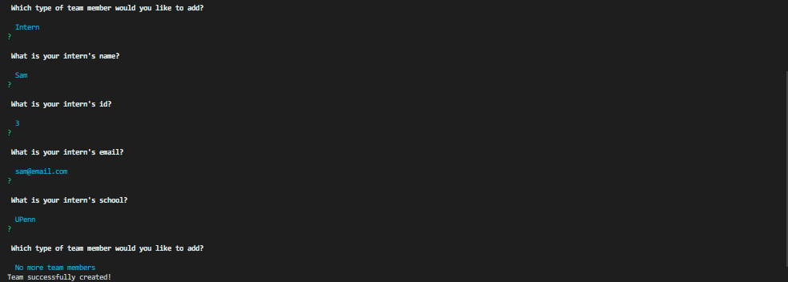
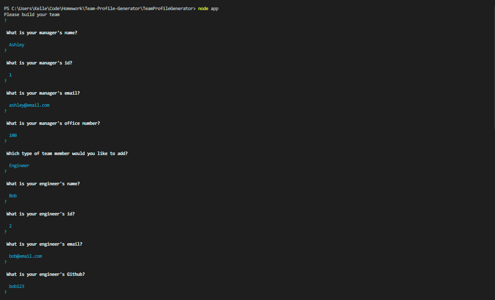
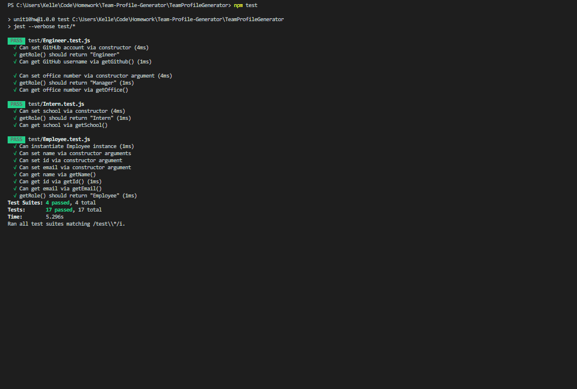

# 👥 Team Profile Generator

 [CLICK HERE FOR APPLICATION WALK THROUGH](https://drive.google.com/file/d/1bhLu0rQtZ7xfDRMs5FQ1AdVNLG6L_58Y/view?usp=sharing)

## Table of Contents

* [Screenshots](#screenshots)

* [User Story](#user-story)

* [Application Description](#application-description)

* [Demo](#demo)

* [Installation](#installation)

* [Tests](#tests)

* [Built With](#built-with)

* [License](#license)

* [Questions](#questions)
 
## Screenshots






## User Story
```
As a manager
I want to generate a webpage that displays my team's basic info
so that I have quick access to emails and GitHub profiles
```
## Application Description

 A software engineering team generator command line application. Prompts the user for information about the team manager and then information about the team members. The user can input any number of team members, and they may be a mix of engineers and interns. When the user has completed building the team, the application creates an HTML file that displays a formatted team roster based on the information provided by the user.

## Demo


 ## Installation

 ```
 npm i
 ```

 ## Tests

 ```
 npm test
 ```
   

## Built With

* Node
* Inquirer
* JSON
* Jest
* JavaScript
* HTML
* Bootstrap

## License

[](https://opensource.org/licenses/MIT)

Copyright 2020 ©Kristy Keller

<sup>Permission is hereby granted, free of charge, to any person obtaining a copy of this software and associated documentation files (the "Software"), to deal in the Software without restriction, including without limitation the rights to use, copy, modify, merge, publish, distribute, sublicense, and/or sell copies of the Software, and to permit persons to whom the Software is furnished to do so, subject to the following conditions:
  
<sup>The above copyright notice and this permission notice shall be included in all copies or substantial portions of the Software.
  
<sup>THE SOFTWARE IS PROVIDED "AS IS", WITHOUT WARRANTY OF ANY KIND, EXPRESS OR IMPLIED, INCLUDING BUT NOT LIMITED TO THE WARRANTIES OF MERCHANTABILITY, FITNESS FOR A PARTICULAR PURPOSE AND NONINFRINGEMENT. IN NO EVENT SHALL THE AUTHORS OR COPYRIGHT HOLDERS BE LIABLE FOR ANY CLAIM, DAMAGES OR OTHER LIABILITY, WHETHER IN AN ACTION OF CONTRACT, TORT OR OTHERWISE, ARISING FROM, OUT OF OR IN CONNECTION WITH THE SOFTWARE OR THE USE OR OTHER DEALINGS IN THE SOFTWARE.

## Questions

If you have any questions regarding this repo, please contact me at the following:

* <keller.kristy@outlook.com>

* [KristyKeller](https://github.com/KristyKeller)
